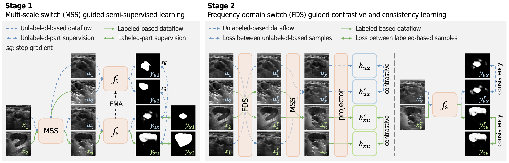
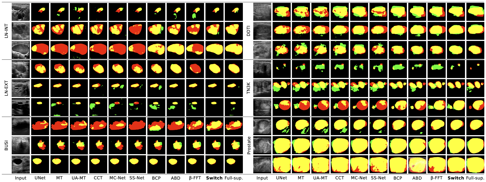
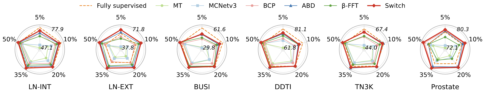

# Multiscale Switch for Semi-Supervised and Contrastive Learning in Medical Ultrasound Image Segmentation

[[Paper](http://doi.org/10.1109/TNNLS.2026.3669814)] [[Datasets](https://github.com/jinggqu/Switch/releases)] [[Online APP](https://polyustar.github.io/sonox)]

## Abstract

We propose **Switch**, a semi-supervised learning framework for medical ultrasound image segmentation with two key innovations:

- 🔀 **Multiscale Switch (MSS)**: Hierarchical patch mixing (128×128 coarse + 32×32 fine) between labeled and unlabeled images for uniform spatial coverage.
- 🌊 **Frequency Domain Switch (FDS)**: Amplitude switching in Fourier space combined with contrastive learning for domain-shift invariance.

At only **5% labeled data**, Switch achieves **85.52% Dice on DDTI** and **83.48% Dice on Prostate**, consistently outperforming fully supervised baselines with just 1.8M parameters.

## Method



**Stage 1 - MSS**: The student network learns from mixed labeled/unlabeled samples generated by multiscale patch masks, supervised by ground truth and teacher pseudo-labels.

**Stage 2 - FDS**: Fourier amplitude is swapped between labeled and unlabeled batches to create frequency-switched pairs, which are aligned via contrastive loss and consistency regularization.

## Results

### Segmentation Visualizations (5% labeled)



### IoU Across All Labeling Ratios



## Datasets

LN-INT and LN-EXT are private hospital datasets and they are not publicly available due to institutional data sharing agreements.

Datasets are stored under `/root/project/data/{dataset}/` with the structure:

```
{dataset}/
├── images/    # grayscale ultrasound images (.png)
├── labels/    # binary segmentation masks (.png)
├── train.txt
├── val.txt
└── test.txt
```

All images are resized to 256×256 during training and evaluation.

## Installation

Requires [uv](https://github.com/astral-sh/uv):

```bash
pip install uv
uv sync
source .venv/bin/activate
```

## Usage

```bash
# Full method: pre-train → self-train → test
python train.py --dataset BUSI --labeled_ratio 0.05

# Test only (load existing self-train checkpoint)
python train.py --dataset BUSI --labeled_ratio 0.05 --test

# BCP semi-supervised baseline
python train_BCP.py --dataset BUSI --labeled_ratio 0.05

# Supervised baseline (100% labels)
python train_single.py --dataset BUSI --labeled_ratio 1.0

# Monitor training
tensorboard --logdir runs/
```

## Project Structure

```
├── train.py         # Switch (MSS + FDS + contrastive + consistency)
├── train_BCP.py     # BCP semi-supervised baseline
├── train_single.py  # Supervised baseline
├── dataset.py       # Data loading and augmentations
├── losses.py        # DiceLoss, ContrastiveLoss
├── util.py          # Metrics and utilities
├── fig/             # Figures for README
└── zoo/
    ├── UNet.py
    └── Projector.py
```

## Citation

```bibtex
@article{qu2026multiscale,
  title={Multiscale Switch for Semi-Supervised and Contrastive Learning in Medical Ultrasound Image Segmentation},
  author={Qu, Jingguo and Han, Xinyang and Pu, Yao and Chui, Man-Lik and Gunda, Simon Takadiyi and Chen, Ziman and Qin, Jing and King, Ann Dorothy and Chu, Winnie Chiu-Wing and Cai, Jing and others},
  journal={IEEE Transactions on Neural Networks and Learning Systems},
  year={2026},
  publisher={IEEE}
}
```

## Acknowledgements

We want to thank the [SSL4MIS](https://github.com/HiLab-git/SSL4MIS), [BCP](https://github.com/DeepMed-Lab-ECNU/BCP), and [ABD](https://github.com/Star-chy/ABD) projects for their contributions to the community. 

## License

CC BY-NC 4.0